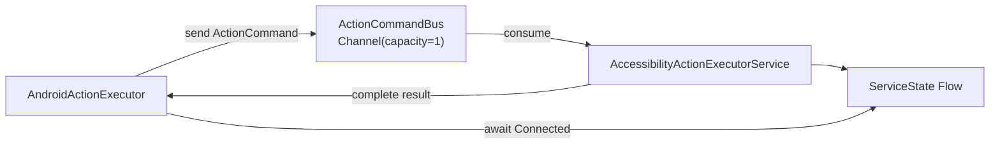
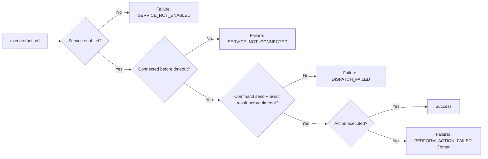

# AccessibilityActionExecutor

## Overview
This module provides a production-grade `AccessibilityService` that executes strongly typed `AgentAction` commands through an in-process coroutine channel. It is intentionally command-driven (no event-driven logic) and supports deterministic backpressure, timeouts, and structured execution results.

## Architecture
- `AccessibilityActionExecutorService` owns execution and consumes commands from a `Channel<ActionCommand>(capacity = 1)`.
- `AndroidActionExecutor` submits commands and awaits results with explicit timeouts.
- `ActionCommandBus` coordinates command flow and maintains `ServiceState` via `MutableStateFlow`.
- All communication is **in-process only**. There is **no Binder**, **no exported services**, **no static service instance access**, and **no `bindService`** usage.

### Lifecycle Diagram

### Failure Flow Diagram

## Buffering Rationale
The command channel is defined as `Channel<ActionCommand>(capacity = 1)` to enforce strict backpressure. This guarantees:
- Only one pending UI action at a time.
- Deterministic action sequencing.
- Protection against command flooding.

## Timeout Rationale
`AndroidActionExecutor.execute()` uses explicit timeouts to prevent indefinite suspension. This ensures:
- Cold-start connection waits do not hang.
- Dispatch and result waits fail predictably.
- Callers always receive a structured `ExecutionResult`.

## Cancellation Propagation
- If the service coroutine scope is cancelled, any active command is completed with `Failure(INTERNAL_ERROR)`.
- A best-effort gesture cancellation is performed: the service marks the active gesture as cancelled and ignores late callbacks.
- Pending commands in the channel are completed with a structured failure when the channel is closed.

## Service Death Handling
If the service is destroyed or the process dies:
- `ServiceState` is set to `Disconnected` when possible.
- The command channel is closed.
- Pending commands are completed with `Failure(SERVICE_NOT_CONNECTED)` or `Failure(INTERNAL_ERROR)` as appropriate.
- `AndroidActionExecutor` surfaces structured failures when channel send/await fails.

## Setup
1. Build and install the app module.
2. Open the app and tap **Open Accessibility Settings**.
3. Enable **Scroller** accessibility service.

## Usage (Host App)
The host app is responsible for DI. Example (already implemented in `ScrollerApp`):
- Instantiate `ActionCommandBus`.
- Instantiate `AndroidActionExecutor(context, commandBus)`.
- Provide `commandBus` to the service via `ActionExecutorDependencies`.

## Troubleshooting
- **Service disabled**: `SERVICE_NOT_ENABLED` — enable in Accessibility Settings.
- **Service not connected in time**: `SERVICE_NOT_CONNECTED` — wait for service to connect or increase timeout.
- **Gesture dispatch failed**: `DISPATCH_FAILED` — ensure service has permission and device supports gestures.
- **No focused input**: `NO_FOCUSED_INPUT` — focus a text field before `Type`.

## Notes on Coordinate Safety
All coordinates are derived from real-time `WindowMetricsCalculator` bounds. There are no hardcoded pixel coordinates or deprecated display APIs.
