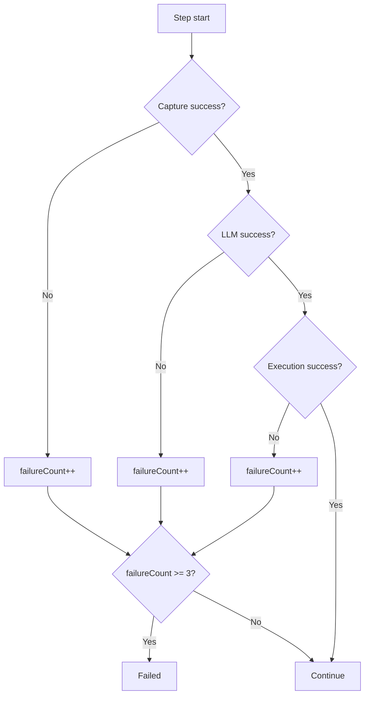

# Agent Loop Controller

## Overview
`AgentLoopController` is the closed-loop engine that sequences **Capture → LLM → Execute** while enforcing strict bounds on timeouts, failures, and maximum steps. It orchestrates only through interfaces and contains no direct Android API usage. Screen fingerprinting occurs outside the Supervisor and is passed as data.

## Sequence Diagram
```mermaid
sequenceDiagram
    participant Loop as AgentLoopController
    participant Capture as ScreenCapture
    participant LLM as LlmClient
    participant Exec as ActionExecutor

    Loop->>Capture: capture() with timeout
    Capture-->>Loop: ScreenFrame
    Loop->>LLM: decideNextAction(goal, screen, history)
    LLM-->>Loop: LlmDecision
    alt Done
        Loop-->>Loop: return Success
    else Action
        Loop->>Exec: execute(action) with timeout
        Exec-->>Loop: ExecutionResult
        Loop-->>Loop: delay and next step
    end
```

## Failure Flow


## Cancellation Flow
- `AgentLoopController` runs in a `SupervisorJob` scope.
- `cancel()` cancels the scope and propagates to capture, LLM, and executor calls.
- Cancellation yields `LoopResult.Cancelled`.

## Bounded Loop Guarantees
- No infinite loops: iteration uses `for (step in 0 until maxSteps)`.
- Timeouts enforced on capture, LLM, and execution.
- Failure threshold aborts loop after 3 failures.

## Why Retries Are Limited
Retries are capped through `failureCount` and `maxSteps`. This prevents runaway action spam and ensures deterministic termination.

## No Android Dependencies
The controller only depends on interfaces:
- `ScreenCapture`
- `LlmClient`
- `ActionExecutor`

It does not access any Android APIs directly.
