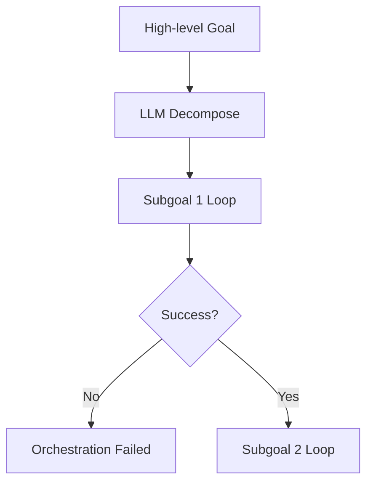

# Orchestrator

## Purpose
Provides lightweight, deterministic goal segmentation. A high-level goal is decomposed into 1–5 sequential subgoals. Each subgoal runs through its own `AgentLoopController` instance.

## Bounded Behavior
- Decomposition happens once per goal.
- Subgoals are executed sequentially (no parallelism).
- Any subgoal failure aborts the entire orchestration.
- No nested orchestration or dynamic insertion.

## Failure Flow

## Why Intentionally Limited
This is not multi-agent AI. It is a bounded sequencing layer to stabilize complex tasks while avoiding runaway loops or hidden retries.
