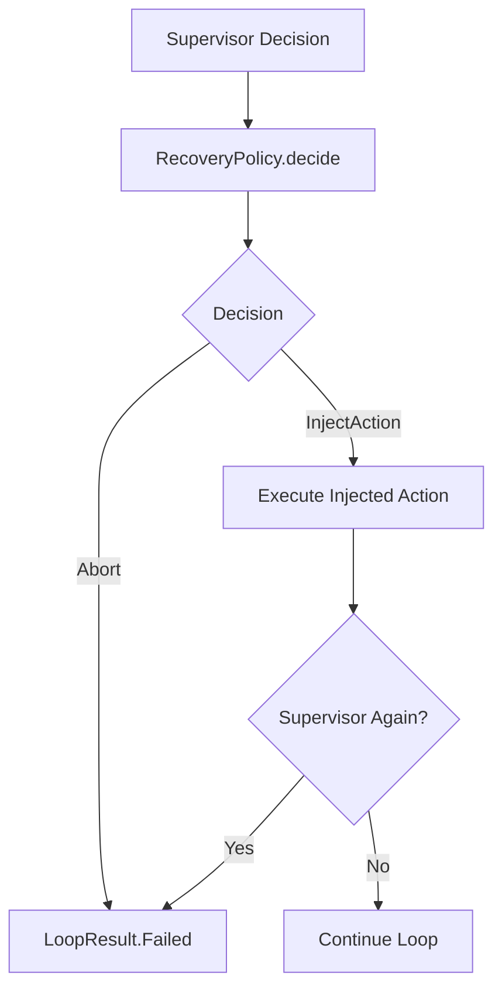

# Recovery Policy

## Purpose
Provides deterministic, bounded recovery actions when the Supervisor flags unsafe or unproductive loop patterns. This policy **does not** execute actions, access Android APIs, or retry recursively.

## Bounded Behavior
- Maximum recovery attempts per run: `maxRecoveryAttempts` (default 2).
- No recursive recovery. If a recovery action itself triggers the Supervisor again, the loop aborts.

## Recovery Decisions
- `RepeatedActionDetected` → Inject `PressBack`.
- `StalledScreenDetected` → Inject `Scroll(DOWN)`.
- `OscillationDetected` → Inject `PressBack`.
- `FailureCascadeDetected` → Abort.

## Failure Flow

## Why Intentionally Limited
Recovery is a safety feature, not an AI planner. It is constrained to a small set of deterministic actions to avoid hidden retries or runaway loops.
