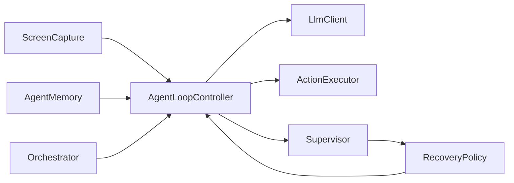
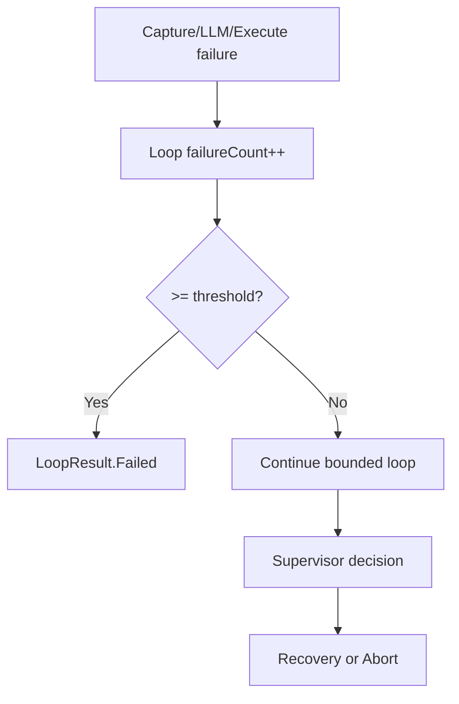

# System Architecture

## Overview
This system is a bounded, deterministic autonomous UI controller composed of:
- Screen capture (MediaProjection)
- LLM reasoning boundary (strict JSON)
- Action executor (Accessibility)
- Agent loop (bounded)
- Supervisor + Recovery (safety)
- Orchestrator (sequential subgoals)
- Memory (bounded context)

## Architecture Diagram

## Failure Flow (High Level)

## Timeout Layering
- Screen capture: `captureTimeoutMs`
- LLM call: `llmTimeoutMs`
- Execution: `executionTimeoutMs`
- Orchestration: single call per goal decomposition

## Memory Bounding
- Actions: 20
- Screen fingerprints: 5
- LLM decisions: 10
- Events: 10

## Recovery Policy
- Deterministic injected actions only.
- Maximum recovery attempts per run.
- Any repeated supervisor trigger after recovery aborts.

## Explicit Non-Goals
- No persistent memory or vector search.
- No dynamic or adaptive learning.
- No recursive orchestration or parallel agents.
- No retries inside LLM client.
